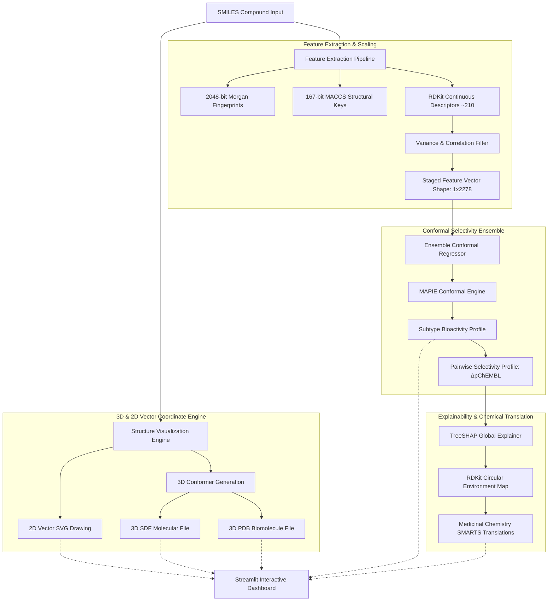

# Systematic QSAR Selectivity Predictor: Flow & Results

A clear, fragmented overview of the structural pipeline, the engine logic, and the validated performance metrics.

---

## 1. Systematic Pipeline Diagram (SMILES Ingestion to Chemical Insights)

The flowchart below traces a candidate compound from its SMILES input through coordinate generation, conformal selectivity modeling, and local medicinal chemistry explanations.

---

## 2. Fragmented Architecture Breakdown

### 📊 Phase A: Data Ingestion & ETL (Dataloader)
* **Parent Ingestion:** Cleans and filters out salts, mixtures, and organometallics to isolate raw parent compound SMILES.
* **Scaffold Isolation:** Employs Bemis-Murcko scaffold groupings to prevent leakage of identical core chemistry between training and testing sets.
* **Mutual Decoy Mapping:** Tagging compounds active on other targets but untested on the query target as boundary controls ($pChEMBL = 3.0$) to define clear selectivity margins.

### 🧪 Phase B: Feature Engineering (Molecular Descriptors)
* **2D Fingerprints:** Combines **2,048-bit Morgan circular fingerprints (radius=2)** and **167-bit MACCS keys** to capture topological functional groups.
* **Continuous Physicochemicals:** Computes RDKit physical descriptors (e.g., MolLogP, TPSA, Weight, H-Bond capacity) to enforce thermodynamic binding physics.

### 🧠 Phase C: Conformal Modeling Suite
* **Conformal Regressors:** Combines Mapie prediction frameworks with XGBoost base estimators.
* **Confidence Safety Bounds:** Predicts continuous $pChEMBL$ affinity value alongside dynamic **90% prediction intervals** on-the-fly, indicating prediction reliability.

### 🔬 Phase D: Explainability & Exporters
* **Dynamic Local SHAP:** Computes local feature contributions for predictions on-the-fly, displaying a waterfall plot.
* **RDKit Chemical Translations:** Dynamically maps Morgan fingerprint contribution bits back to the molecule's exact atoms and radius, outputting readable **SMARTS structural moieties** (e.g. `[#6]:[#6](:[#6])-[#7]`).
* **Multi-Format Downloader:** Generates 2D SVG vectors, 3D SDF coordinates, 3D PDB coordinates, and prediction CSVs instantly.

---

## 3. Core Performance & Validation Results

The models are strictly validated using **Nested Cross-Validation with Scaffold Splits** (ensuring all test compounds belong to completely unseen Murcko scaffolds) to prevent target memorization.

### 🎯 Overall Conformal Performance (Unified Precise Mode)
* **Dataset Size:** 9,589 curated parent compounds across all subtypes
* **Overall MAE:** `0.520 pChEMBL units` (Mean Absolute Error)
* **Overall R²:** `0.408` (Variance Explained)
* **Average Prediction Width:** `±0.688 pChEMBL units` (90% Conformal Interval Bound)

### 📈 Receptor Subtype Potency Breakdown
| Subtype Target | Training Compounds | Testing Compounds | Validation R² | Validation MAE | Validation RMSE |
| :--- | :--- | :--- | :--- | :--- | :--- |
| **A₁ Subtype** | 1,236 | 285 | **0.241** | 0.647 | 0.854 |
| **A₂A Subtype** | 2,737 | 781 | **0.419** | 0.520 | 0.670 |
| **A₂B Subtype** | 1,392 | 333 | **0.627** | 0.383 | 0.498 |
| **A₃ Subtype** | 2,298 | 527 | **0.369** | 0.537 | 0.716 |
