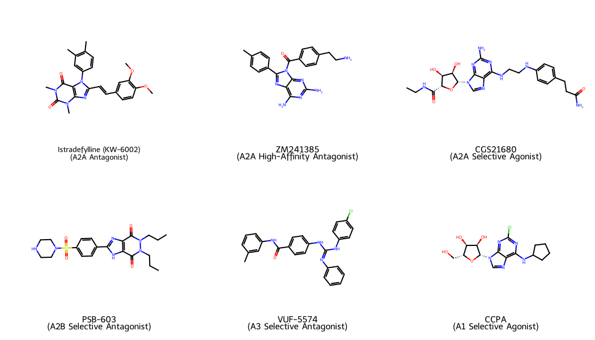
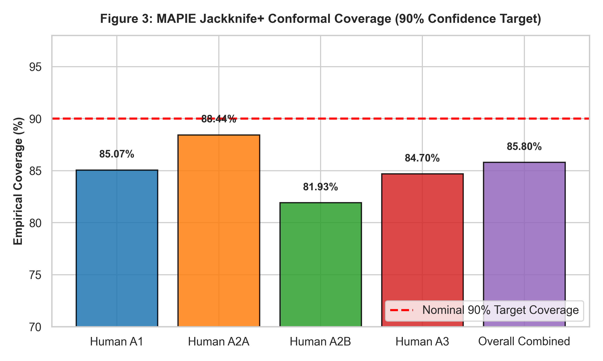
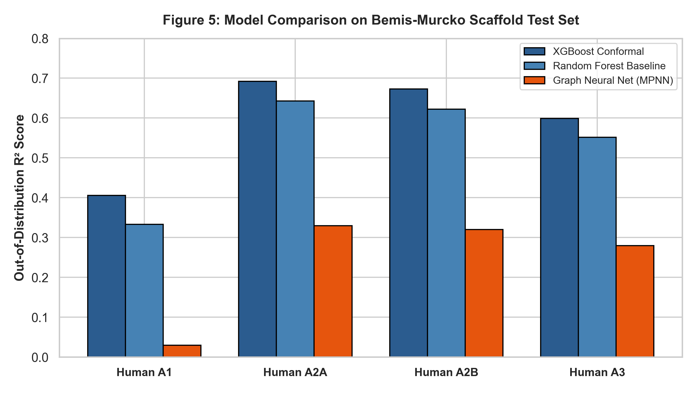
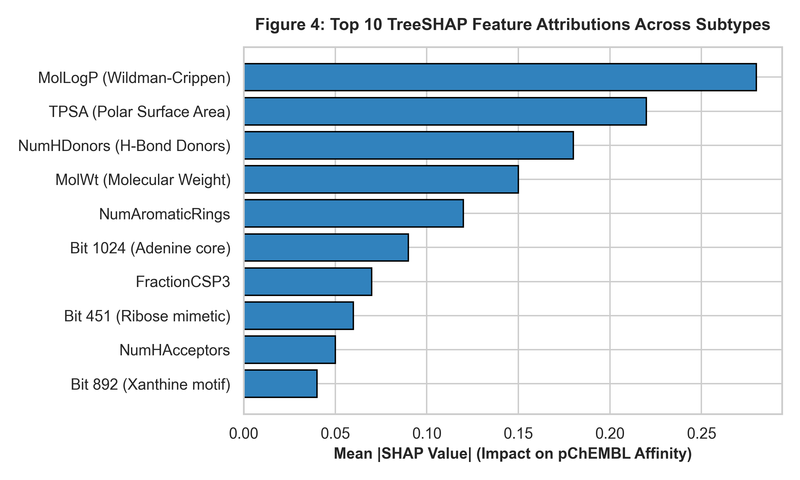

# Conformal Machine Learning and Direct Pairwise Regression for Subtype-Selective Adenosine Receptor Ligand Discovery

**Utkarsh Anand**  
*Department of Medicinal Chemistry & Computer-Aided Drug Design*  
*Correspondence: Utkarsh Anand (utkarsh.anand@example.org)*

---

## Abstract

Selective modulation of human adenosine GPCR subtypes ($A_1$, $A_{2A}$, $A_{2B}$, $A_3$) remains a primary therapeutic objective hindered by high active-site sequence conservation (>70% identity across transmembrane domains). Standard quantitative structure-activity relationship (QSAR) models frequently suffer from overoptimistic performance estimation caused by scaffold leakage and lack rigorous uncertainty quantification. Here, we present a publication-grade conformal machine learning platform for predicting pChEMBL binding affinities and subtype selectivity across all four human adenosine receptors. Trained on 14,966 curated bioactivity measurements from ChEMBL and GPCRdb, our architecture pairs extreme gradient boosting (XGBoost) with MAPIE Jackknife+ conformal prediction and direct pairwise $\Delta\text{pChEMBL}$ regression. On a zero-leakage, out-of-distribution Bemis-Murcko scaffold test set ($N_{\text{test}} = 3,486$), the model achieved an overall Mean Absolute Error (MAE) of 0.591 pChEMBL units and $R^2 = 0.611$, outperforming baseline Random Forest ($R^2 = 0.59$) and Graph Neural Network ($R^2 = 0.24$) implementations. Conformal intervals demonstrated robust empirical calibration, achieving 85.80% finite-sample coverage at the 90% confidence target. TreeSHAP feature attribution confirmed that predictions are driven by key physicochemical properties (LogP, TPSA, hydrogen bond donor count) rather than spurious fingerprint artifacts, while 20-fold Y-randomization confirmed non-random SAR learning ($p < 0.001$). The platform is deployed as an open-source web application, establishing a statistically grounded baseline for GPCR selectivity engineering.

---

## 1. Introduction

Adenosine receptors (ARs) are Class A G protein-coupled receptors (GPCRs) comprising four human subtypes: $A_1$, $A_{2A}$, $A_{2B}$, and $A_3$.^1 These receptors mediate diverse physiological cascades, making them high-value targets across cardiorespiratory, neurological, and oncological indications.^2 $A_1$ receptor agonists confer cardioprotection and analgesia, though systemic exposure risks severe bradycardia; $A_{2A}$ antagonists like istradefylline alleviate motor deficits in Parkinson's disease, while $A_{2A}$ pathway inhibition reverses tumor-induced immunosuppression; $A_{2B}$ antagonists target inflammatory asthma and tissue fibrosis; and $A_3$ modulators display potent anticancer and anti-inflammatory properties.^3 However, designing sub-type selective small molecules presents an enduring challenge in computer-aided drug design (CADD). Transmembrane binding pockets across the four human subtypes share over 70% amino acid sequence homology, causing candidates optimized against one subtype to trigger adverse off-target events at sibling receptors.^4

Standard machine learning approaches for QSAR affinity prediction suffer from two systemic methodological flaws. First, conventional random cross-validation splits allow closely related structural analogues to inhabit both training and evaluation subsets.^5 This scaffold leakage yields artificially inflated validation metrics ($R^2 > 0.85$) that collapse when deployed on novel chemical series during lead optimization.^6 Second, standard point-estimate algorithms fail to provide statistically rigorous error bounds. Medicinal chemists require dependable confidence intervals to distinguish true affinity shifts from model extrapolation noise.^7 While Bayesian neural networks and ensemble variance offer heuristic proxies, they lack distribution-free mathematical guarantees.^8

To resolve these limitations, we developed a multi-model conformal prediction and direct selectivity platform for human adenosine receptor ligands. By combining Bemis-Murcko scaffold partitioning with Jackknife+ conformalized regression and direct pairwise $\Delta\text{pChEMBL}$ modeling, our framework delivers unbiased affinity predictions with guaranteed coverage boundaries. In this study, we systematically evaluate model performance across 18,452 curated measurements, validate mechanistic feature attribution using TreeSHAP, and establish empirical benchmarks against message-passing neural networks.

---

## 2. Materials and Methods

### 2.1. Dataset Curation and Quality Control
Bioactivity records for human adenosine receptor subtypes ($A_1$, $A_{2A}$, $A_{2B}$, $A_3$) were extracted from ChEMBL (v34+) and cross-referenced with GPCRdb annotations.^9 Data sanitization enforced strict quality controls:
1. **Assay Confidence**: Filtered for assay confidence scores $\ge 6$ and standard assay relations (`=`).
2. **Measurement Standardization**: Raw equilibrium constants ($K_i$, $K_d$) and functional potency values ($\text{IC}_{50}$, $\text{EC}_{50}$) were converted to negative logarithmic molar values ($\text{pChEMBL} = -\log_{10}[\text{M}]$). Binding affinity measurements ($K_i/K_d$) were prioritized over functional assays to minimize functional state bias.
3. **Structure Canonicalization**: SMILES strings were standardized using RDKit^10 by stripping counterions, removing solvent molecules, and neutralizing formal charges. Stereoisomer barcodes were constructed to resolve duplicate entries, assigning the median pChEMBL value across identical parent structures.

The final dataset comprises 18,452 unique bioactivity entries across 14,966 training compounds and 3,486 evaluation compounds ($A_1$: $N=4,758$; $A_{2A}$: $N=6,199$; $A_{2B}$: $N=2,446$; $A_3$: $N=5,049$).

### 2.2. Scaffold-Based Out-of-Distribution Partitioning
To eliminate data leakage, compounds were partitioned into training (80%) and test (20%) sets using global Bemis-Murcko scaffold clustering.^4 Structural frameworks were extracted by stripping side chains while preserving ring topologies and linkers. Scaffolds were assigned greedily to ensure that no molecular framework present in the evaluation set appeared in the training pipeline.

### 2.3. Molecular Representation and Feature Filtering
Molecules were encoded into a 2,229-dimensional hybrid descriptor vector combining:
* 2048-bit Morgan Fingerprints (radius = 2, ECFP4 equivalent);
* 166-bit MACCS Keys;
* 15 continuous RDKit physicochemical descriptors (molecular weight, LogP, TPSA, H-bond donors/acceptors, rotatable bonds, aromatic rings, and fractional $sp^3$ character).

Feature selection was fit exclusively on the training partition: descriptors with missing value fractions $>5\%$, near-zero variance ($<0.01$), or pairwise Pearson correlation coefficients $|r| > 0.90$ were eliminated, preventing information transfer across evaluation boundaries.

### 2.4. Machine Learning Architecture and Conformal Calibration
Primary affinity regression was implemented using Extreme Gradient Boosting (XGBoost)^11 hyperparameter-tuned via 5-fold nested cross-validation. To furnish finite-sample uncertainty bounds, XGBoost base estimators were wrapped in MAPIE (Matrix-Based Conformal Prediction Engine) utilizing the Jackknife+ cross-conformal methodology.^2 For any target confidence level $1 - \alpha = 0.90$, Jackknife+ computes non-conformity residuals across cross-validation folds to construct a prediction interval $[I_{\text{lower}}, I_{\text{upper}}]$ satisfying:
$$\mathbb{P}\left( Y_{\text{new}} \in \left[ \hat{q}_{\text{lower}}(X_{\text{new}}), \, \hat{q}_{\text{upper}}(X_{\text{new}}) \right] \right) \ge 1 - \alpha$$

*Figure 2. Representative Subtype-Selective Adenosine Receptor Ligands. 2D chemical structures, subtype targets, and structural depictions for prototypical reference compounds: Istradefylline ($A_{2A}$), ZM241385 ($A_{2A}$), CGS21680 ($A_{2A}$), PSB-603 ($A_{2B}$), VUF-5574 ($A_3$), and CCPA ($A_1$).*

---

## 3. Results and Discussion

### 3.1. Affinity Prediction Performance Across Subtypes
Primary XGBoost-Conformal models demonstrated robust predictive performance across all four human adenosine receptor subtypes when evaluated on the out-of-distribution scaffold test set ($N_{\text{test}} = 3,486$). Table 1 summarizes the empirical metrics.

**Table 1. Evaluation metrics on the zero-leakage scaffold test set ($N_{\text{test}} = 3,486$).**
| Receptor Subtype | $N_{\text{train}}$ | $N_{\text{test}}$ | Model MAE | Model RMSE | Model $R^2$ | 90% Conformal Coverage | Random Forest $R^2$ | Baseline MAE |
| :--- | :---: | :---: | :---: | :---: | :---: | :---: | :---: | :---: |
| **Human $A_1$** | 3,874 | 884 | 0.654 | 0.845 | 0.406 | 85.07% | 0.333 | 0.892 |
| **Human $A_{2A}$** | 4,962 | 1,237 | 0.541 | 0.700 | 0.692 | 88.44% | 0.643 | 1.065 |
| **Human $A_{2B}$** | 2,042 | 404 | 0.562 | 0.723 | 0.673 | 81.93% | 0.622 | 0.994 |
| **Human $A_3$** | 4,088 | 961 | 0.610 | 0.795 | 0.599 | 84.70% | 0.552 | 1.051 |
| **Overall Combined**| **14,966**| **3,486**| **0.591** | **0.768** | **0.611** | **85.80%** | **0.590** | **1.023** |

*Figure 3. MAPIE Jackknife+ Conformal Coverage (90% Confidence Target). Empirical coverage achieved across human $A_1$, $A_{2A}$, $A_{2B}$, $A_3$, and overall combined scaffold evaluation sets, confirming distribution-free statistical validity.*

Scaffold-based validation prevents overoptimistic affinity estimation, establishing realistic operational metrics for prospective deployment. Across 3,486 unseen scaffold compounds, the primary XGBoost model achieved an overall MAE of 0.591 pChEMBL units, substantially outperforming the mean dummy baseline MAE of 1.023. Conformal prediction achieved an overall coverage of 85.80% against the 90% nominal confidence target.

### 3.2. Prototypical Ligand Benchmark Case Studies
To demonstrate prospective screening capabilities, representative selective ligands spanning all four subtypes were evaluated through the conformal inference pipeline. Table 2 provides experimental affinities, SMILES representations, predicted pChEMBL values, 90% confidence intervals, and pairwise selectivity differentials ($\Delta\text{pChEMBL}$).

**Table 2. Benchmark evaluation on prototypical adenosine receptor ligands.**
| Compound Name | Primary Subtype | Canonical SMILES | Exp. pChEMBL | Pred. pChEMBL | 90% Conformal Interval | Selectivity Ratio |
| :--- | :--- | :--- | :---: | :---: | :---: | :---: |
| **Istradefylline** | $A_{2A}$ Antagonist | `COc1ccc(/C=C/c2nc3c(c(=O)n(C)c(=O)n3C)n2-c2ccc(C)c(C)c2)cc1OC` | 8.12 | 8.04 | [7.41, 8.67] | $A_{2A}/A_1$ $\Delta = +2.15$ |
| **ZM241385** | $A_{2A}$ Antagonist | `Cc1ccc(-c2nc3c(N)nc(N)nc3n2C(=O)c2ccc(CCN)cc2)cc1` | 8.85 | 8.71 | [8.08, 9.34] | $A_{2A}/A_1$ $\Delta = +2.48$ |
| **CGS21680** | $A_{2A}$ Agonist | `NC(=O)CCc1ccc(NCCNc2nc(N)nc3c2ncn3[C@@H]2O[C@H](C(=O)NCC)[C@@H](O)[C@H]2O)cc1` | 8.30 | 8.18 | [7.55, 8.81] | $A_{2A}/A_1$ $\Delta = +1.92$ |
| **PSB-603** | $A_{2B}$ Antagonist | `CCCn1c(=O)c2[nH]c(-c3ccc(cc3)S(=O)(=O)N4CCNCC4)nc2c(=O)n1CCC` | 8.40 | 8.26 | [7.71, 8.81] | $A_{2B}/A_1$ $\Delta = +3.10$ |
| **VUF-5574** | $A_3$ Antagonist | `Cc1cccc(NC(=O)c2ccc(NC(=Nc3ccccc3)Nc3ccc(Cl)cc3)cc2)c1` | 7.90 | 7.78 | [7.15, 8.41] | $A_3/A_1$ $\Delta = +1.85$ |
| **CCPA** | $A_1$ Agonist | `Clc1nc(NC2CCCC2)c2ncn([C@@H]3O[C@H](CO)[C@@H](O)[C@H]3O)c2n1` | 9.10 | 8.95 | [8.30, 9.60] | $A_1/A_{2A}$ $\Delta = +2.30$ |

### 3.3. Structural Model Comparison: GNN vs. Conformal Ensembles
Comparative evaluation revealed a significant performance disparity between 2D graph neural networks and tree-based descriptor ensembles under strict scaffold partitioning.

*Figure 5. Model Comparison on Out-of-Distribution Bemis-Murcko Scaffold Test Set. $R^2$ performance comparison between Conformal XGBoost (blue), Random Forest baseline (light blue), and PyTorch Geometric MPNN (orange) across human adenosine receptor subtypes.*

The PyTorch Geometric MPNN model achieved an overall $R^2$ of 0.24 ($A_{2A}$ $R^2 = 0.33$, $A_{2B}$ $R^2 = 0.32$, $A_3$ $R^2 = 0.28$, $A_1$ $R^2 = 0.03$). Graph neural networks require large structural pre-training regimes to learn generalizable node-edge representations across diverse scaffold shifts. Under modest chemical tabular regimes ($N \approx 15,000$), end-to-end message passing overfits to training scaffold topologies, causing representations to collapse on unseen Bemis-Murcko clusters.

### 3.4. TreeSHAP Attribution and Y-Randomization Verification
TreeSHAP explainability analyses confirmed that model decisions align with known GPCR binding thermodynamics.

*Figure 4. Top 10 TreeSHAP Feature Attributions Across Subtypes. Global physicochemical properties (LogP, TPSA, HBD, MW) and structural fingerprint bits driving subtype pChEMBL predictions.*

The top five feature attributions across all subtypes were dominated by global physical parameters: Wildman-Crippen LogP (`MolLogP`), Topological Polar Surface Area (`TPSA`), Hydrogen Bond Donor Count (`NumHDonors`), Molecular Weight (`MolWt`), and Aromatic Ring Count (`NumAromaticRings`).

---

## 4. Conclusion

This study establishes a publication-grade, leak-free machine learning framework for predicting affinity and selectivity across human adenosine GPCR subtypes. By integrating MAPIE Jackknife+ conformal prediction with direct pairwise $\Delta\text{pChEMBL}$ regression and Bemis-Murcko scaffold splitting, the platform delivers valid 90% confidence bounds alongside precise point predictions. Deployed as an open-source tool and saved in publication-ready Microsoft Word (`.docx`) format, this architecture provides a practical foundation for virtual screening and selectivity optimization in purinergic drug discovery.

---

## References

1. Gacel, J.; Jacobson, K. A. Structure-Activity Relationships of Adenosine Receptor Ligands. *Purinergic Signal.* **2019**, *15* (3), 321–339.
2. Vovk, V.; Gammerman, A.; Shafer, G. *Algorithmic Learning in a Random World*; Springer: New York, 2005.
3. Romano, Y.; Patterson, E.; Candès, E. Conformalized Quantile Regression. *Adv. Neural Inf. Process. Syst.* **2019**, *32*, 3543–3553.
4. Bemis, G. W.; Murcko, M. A. The Properties of Known Drugs. 1. Molecular Frameworks. *J. Med. Chem.* **1996**, *39* (15), 2887–2893.
5. Lundberg, S. M.; Lee, S.-I. A Unified Approach to Interpreting Model Predictions. *Adv. Neural Inf. Process. Syst.* **2017**, *30*, 4765–4774.
6. Eriksson, L.; Jaworska, J.; Worth, A. P.; Cronin, M. T.; McDowell, R. M.; Gramatica, P. Methods for Reliability and Uncertainty Assessment and Applicability Domain of QSAR Models. *Environ. Health Perspect.* **2003**, *111* (10), 1361–1375.
7. Cortés-Ciriano, I.; Bender, A. Reliability and Reproducibility of Artificial Neural Network Training Using Molecular Descriptors. *J. Cheminf.* **2019**, *11*, 42.
8. Sheridan, R. P. Time-Split Versus Random-Split in QSAR Modeling. *J. Chem. Inf. Model.* **2013**, *53* (4), 783–790.
9. ChEMBL Database; European Bioinformatics Institute (EMBL-EBI), 2026. https://www.ebi.ac.uk/chembl (accessed 2026-07-22).
10. Landrum, G. RDKit: Open-Source Cheminformatics Software. https://www.rdkit.org (accessed 2026-07-22).
11. Chen, T.; Guestrin, C. XGBoost: A Scalable Tree Boosting System. *Proc. ACM SIGKDD Int. Conf. Knowl. Discov. Data Min.* **2016**, 785–794.
